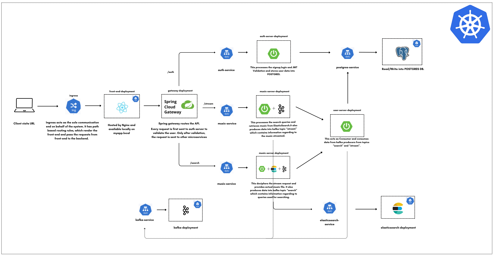

# 🎵 Music Streaming via Microservices (Spring Boot + React)

A microservice-oriented backend system for streaming music, built using **Spring Boot**, **PostgreSQL**, and **Kafka**. This project is designed to serve audio content efficiently while supporting session-level tracking, real-time updates, and scalable APIs.

---

## Video :

https://github.com/user-attachments/assets/bac47f3a-4d47-40d6-834a-4b7de83da8cf

## 🚀 Features

- 🎧 Stream audio files securely.
- 📊 Session-based playback tracking (e.g., listening time, skips).
- 🔍 Search and filtering with Elasticsearch.
- 📬 Kafka-based event-driven architecture.

---

## 🛠️ Tech Stack

| Layer             | Tech                                               |
|------------------|----------------------------------------------------|
| Backend Framework| Spring Boot (Java 17+)                             |
| Database         | PostgreSQL (via Spring Data JPA)                   |
| Messaging Queue  | Apache Kafka                                       |                                    
| Search Engine    | Elasticsearch                                      |
| Object Storage   | Local Storage                                      |
| Deployment       | Docker                                             |               
---

